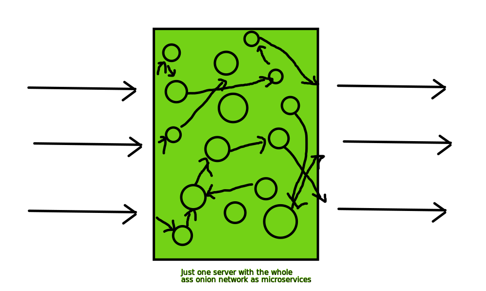

# onion-farm
onion network on one server with microservices (just server processes running on the machine, not docker container or anything) as the nodes

Here's a really super awesome good 10/10 graphic design picture describing what I have in mind

So we have one server that routes messages, but when they exit the server we don't know who they came from, because in the routing the message goes through a bunch of onion nodes. Each node will be a process on the machine, running as a (probably Java) server program

This could probably even be simplified to one server program that has in-memory "nodes" and would still work the same way, but keeping a bunch of separate server processes that communicate via HTTP as nodes makes this more akin to a real across-many-machines onion network, and the possibility of adding outside-of-machine nodes is a lot more possible.
